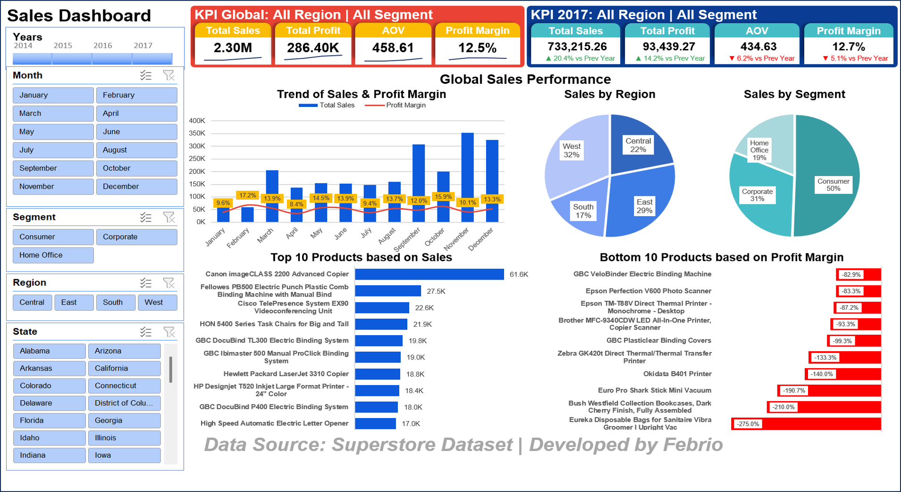
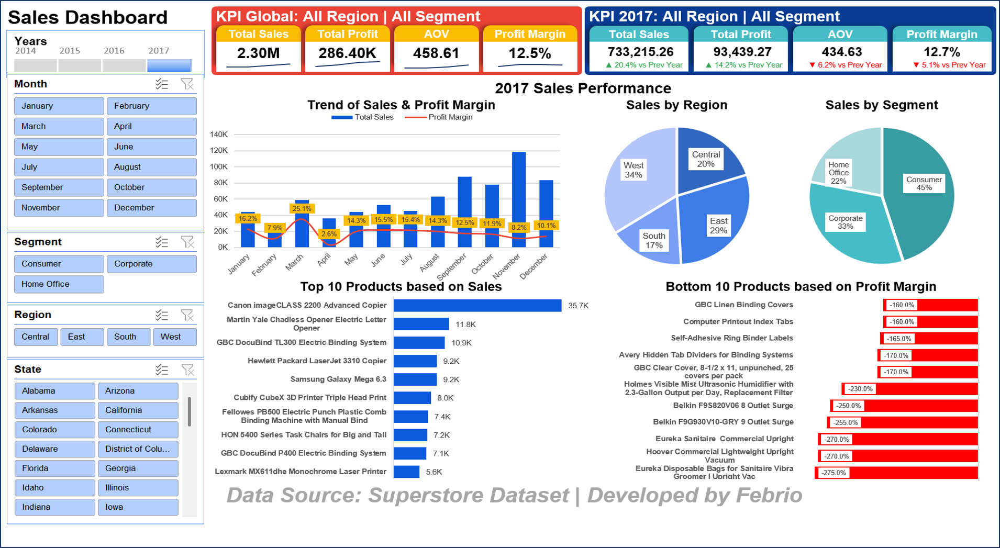
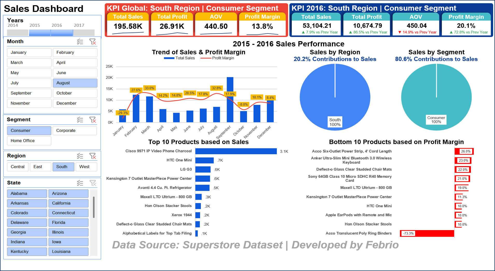

# 📊 Interactive Sales Dashboard — Pure Formula, Zero Macro

> A fully interactive Excel dashboard built under one strict constraint: **no VBA, no macros, no Developer tab** — completed in a single day. Every interactive behavior is driven purely by Pivot Tables, formulas, and shape linking.

---

## The Constraint

Most interactive Excel dashboards rely on VBA or macros to handle dynamic UI behavior. I deliberately avoided this for two practical reasons:

1. **Portability** — Macro-enabled files (.xlsm) are frequently blocked by corporate email filters and cloud storage policies. Staying in .xlsx format ensures the file opens anywhere, without security warnings.
2. **Transparency** — Formula-driven logic is auditable. Anyone can trace the logic without needing to open a VBA editor.

The real challenge: delivering the same dynamic behavior that most people solve with 10 lines of VBA — using only what Excel gives you by default.

---

## The Problem

Building a dashboard that *feels* interactive without any programmatic control means every UI state change must be anticipated and encoded in formulas ahead of time. There is no event listener. There is no trigger. The formula either handles the edge case, or it breaks silently — which is worse.

Three specific problems made this non-trivial:

---

## The Solution

### 1. Conditional Growth Indicator via Shape Linking
KPI cards display a growth indicator (▲▼) alongside year-over-year performance. The indicator is a formula-driven text value linked directly to a shape — not conditional formatting, not an icon set.

The edge case: when the earliest available year is selected, there is no prior year to compare against. Rather than returning an error or a misleading value, the indicator gracefully outputs `"-"` to signal that comparison data is unavailable.

### 2. Context-Aware Contribution Toggle
The Sales by Region and Sales by Segment charts display a contribution percentage — but only when it's meaningful. When all filters within a dimension are active (e.g., all 3 segments selected), showing "100% contribution" is noise, not insight. The formula detects this state and automatically hides the contribution label. The moment a user narrows the selection to a subset, the label reappears showing the selected group's contribution to total national sales.

No button. No macro. The chart responds to filter state automatically.

### 3. Intelligent Dynamic KPI Title with Multi-Layer Hierarchy
The KPI card title reads the active state of three slicers simultaneously — Region, State, and Segment — and constructs a context-aware label using nested AND/OR logic.

The hierarchy is intentional:
- State filter takes priority over Region filter when active
- Each dimension falls back to "All [Dimension]" 
when unfiltered

Example outputs:
- `All Region | All Segment`
- `West Region | Consumer Segment`
- `Arizona State | Consumer Segment`

This required anticipating every meaningful filter combination and encoding the priority logic explicitly in formula — not a simple CONCATENATE.

---

## Dashboard Views

### Global View — All Years, All Filters

### Single Year View — 2017, All Filters

### Filtered View — 2015-2016, South Region, Consumer Segment

---

## What I'd Do Differently

Two things I would change if I rebuilt this today:

**1. Replace pie charts with donut charts**
The contribution percentage currently appears as a label 
beside the chart. In a donut chart, that number lives 
in the center — more readable, more intentional, 
less visual clutter.

**2. Add a deep-dive sheet**
The current dashboard is executive-level: high-level KPIs 
and trends. A second sheet with product-level and 
state-level drill-down would make this a complete 
analytical tool, not just a summary view.

---

## Technical Stack

| Component | Tool |
|---|---|
| Data modeling | Pivot Tables |
| UI interactivity | Formula + Shape Linking |
| Filtering | Slicers |
| Macros/VBA | None |
| File format | .xlsx |

---

## Data Source
Superstore Dataset — a widely used retail dataset commonly 
used for business intelligence and data visualization practice.

---

*Developed by Febrio*
